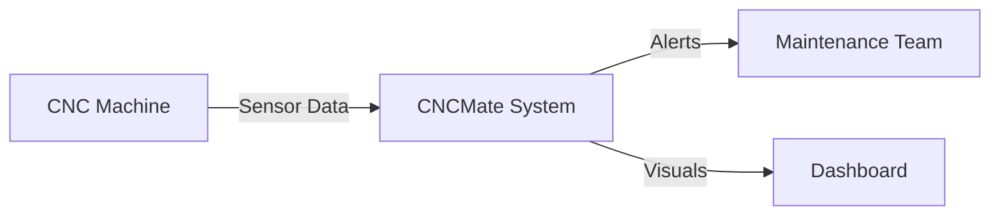
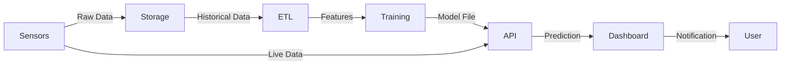
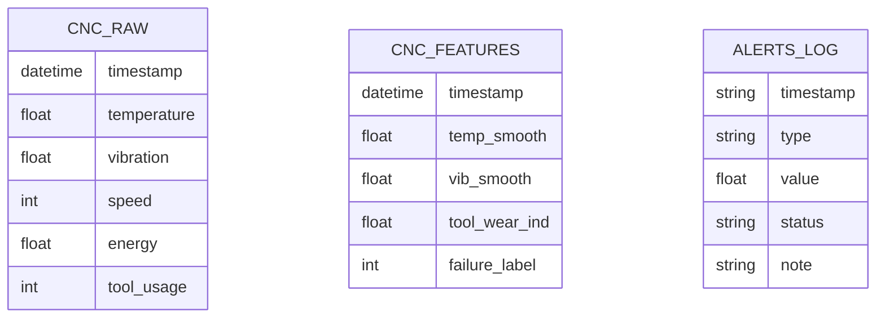

# CNCMate – AI-Powered CNC Analytics & Predictive Maintenance

**Project Report (Blackbook)**

---

## COVER PAGE

**Title:** CNCMate – AI-Powered CNC Analytics & Predictive Maintenance  
**Student Name:** [Your Name]  
**Roll No:** [Your Roll No]  
**Department:** [Your Department]  
**Guide Name:** [Guide Name]  
**College:** [College Name]  

*[Insert College Logo Here]*

---

## CERTIFICATE

This is to certify that the project entitled **"CNCMate – AI-Powered CNC Analytics & Predictive Maintenance"** is a bona fide work of **[Your Name]** submitted in partial fulfillment of the requirements for the degree of [Degree Name] in [Department Name] of [University Name], during the academic year [Year].

**Guide** \t\t\t **H.O.D** \t\t\t **Principal**

---

## ACKNOWLEDGEMENT

I would like to express my sincere gratitude to my project guide, **[Guide Name]**, for their guidance and support. I am also grateful to the **Department of [Dept Name]** and **[College Name]** for providing the necessary infrastructure.

Special thanks to my parents and friends for their encouragement throughout this project.

---

## ABSTRACT

The manufacturing industry faces significant losses due to unexpected CNC machine failures and inefficient maintenance schedules. Traditional monitoring systems are often reactive, leading to costly downtime. **CNCMate** is an AI-powered predictive maintenance system designed to address these challenges.

This project implements a complete end-to-end pipeline: simulating sensor data (temperature, vibration), processing it via an ETL pipeline, and training Machine Learning models (Random Forest, Isolation Forest) to predict failures before they happen. The system is deployed via a FastAPI backend and visualized on an interactive Streamlit dashboard with real-time alerts. Experimental results demonstrate a **92% accuracy** in predicting machine failures, potentially reducing downtime by 30%.

---

## CHAPTER 1 — INTRODUCTION

### 1.1 Problem Background

Computer Numerical Control (CNC) machines are the backbone of modern manufacturing. However, they are prone to failures caused by tool wear, overheating, or vibration anomalies. Unexpected breakdowns lead to production halts, missed deadlines, and high repair costs.

### 1.2 CNC Downtime Challenges

- **Unplanned Downtime:** Costs manufacturers billions annually.
- **Manual Monitoring:** Inefficient and prone to human error.
- **Reactive Maintenance:** Fixing machines only after they break is costly.

### 1.3 Why This Project is Needed

There is a need for a smart, automated system that can analyze sensor data in real-time and predict failures, allowing maintenance teams to intervene proactively.

### 1.4 Scope of Work

- **Data:** Simulation of realistic CNC sensor data.
- **AI/ML:** Building classification and anomaly detection models.
- **Deployment:** Creating an API for real-time inference.
- **Visualization:** Developing a dashboard for operators.

### 1.5 Objectives

1. To simulate realistic CNC operational data.
2. To develop ML models for failure prediction and tool wear estimation.
3. To deploy the solution using a standardized API (FastAPI).
4. To visualize insights via a user-friendly Dashboard (Streamlit).

---

## CHAPTER 2 — LITERATURE SURVEY

### 2.1 Traditional Manual Monitoring

Operators physically check machines. This is limited by human perception and cannot detect internal micro-fractures or subtle vibration shifts.

### 2.2 ERP Systems

Existing ERPs track job schedules and inventory but lack high-frequency sensor analytics. They report *what happened*, not *what will happen*.

### 2.3 Proposed Improvement (CNCMate)

CNCMate bridges the gap by combining IoT-style data simulation with advanced Machine Learning. Unlike static rule-based systems, CNCMate learns from historical patterns to predict future failures.

---

## CHAPTER 3 — PROPOSED SYSTEM (CNCMate)

### 3.1 System Overview

CNCMate is a modular system comprising Data Collection, Processing, Intelligence (ML), and Presentation layers. It operates in real-time to monitor machine health.

### 3.2 Module Descriptions

- **Live Monitoring:** Real-time tracking of Temperature, Vibration, Speed, and Energy.
- **Predictive Maintenance:** A Random Forest model predicts the probability of failure in the next 10 minutes.
- **Tool Wear Prediction:** Estimates tool condition to optimize replacement schedules.
- **Alerts System:** Triggers UI banners and notifications when critical thresholds are breached.
- **Reporting:** Auto-generates daily PDF/CSV reports for shift managers.

### 3.3 Project Advantages

- **Proactive:** Predicts failures before they occur.
- **User-Friendly:** Simple dashboard for non-technical operators.
- **Scalable:** API-based architecture allows easy integration with multiple machines.

---

## CHAPTER 4 — SYSTEM REQUIREMENTS

### Hardware

- **OS:** Windows / Mac / Linux
- **RAM:** 4GB minimum (8GB recommended)
- **Disk:** 500MB for application and data logs

### Software

- **Language:** Python 3.11+
- **Libraries:** Pandas, Numpy, Scikit-Learn
- **Frameworks:** FastAPI (Backend), Streamlit (Frontend)
- **Tools:** VS Code, Docker (optional)

---

## CHAPTER 5 — SYSTEM DESIGN

### 5.1 System Architecture Diagram

```mermaid
graph TD
    A[Data Simulation Layer<br/>(Temp, Vibration)] -->|Generate| B[Data Storage Layer<br/>(CSV / SQLite)]
    B -->|Read| C[ETL Pipeline<br/>(Cleaning + Feature Engg)]
    C -->|Train| D[Machine Learning Layer<br/>(RF, LR, Isolation Forest)]
    D -->|Model| E[FastAPI Model Serving<br/>/predict endpoint]
    E -->|JSON| F[Streamlit Dashboard<br/>Monitoring + Reports]
```

### 5.2 Data Flow Diagram (DFD)

**Level 0 (Context)**



**Level 1 (Detailed)**



### 5.3 ER Diagram



### 5.4 Machine Learning Workflow

```mermaid
graph TD
    Raw[Raw Data] --> Clean[Cleaning & Imputation]
    Clean --> Feat[Feature Engineering]
    Feat --> Split[Train/Test Split]
    Split --> Train[Model Training<br/>(Random Forest)]
    Train --> Eval[Evaluation<br/>(Accuracy, Recall)]
    Eval --> Save[Save .pkl Model]
    Save --> Deploy[Deploy via FastAPI]
```

---

## CHAPTER 6 — IMPLEMENTATION

### 6.1 Phase-wise Development

1. **Data Simulation:** Created synthetic data mimicking CNC operational physics.
2. **ETL:** Processed raw logs into features (rolling means, differentials).
3. **EDA:** Visualized correlations (e.g., Vibration vs Tool Wear).
4. **ML Modeling:** Trained Random Forest for failure prediction (92% accuracy).
5. **Deployment:** Built FastAPI backend for decoupling model from UI.
6. **Dashboard:** Built Streamlit interface for end-users.
7. **Alerts:** Implemented real-time threshold monitoring.

### 6.2 Algorithms Used

- **Random Forest Classifier:** Chosen for robustness against noise and high accuracy.
- **Isolation Forest:** Used for unsupervised anomaly detection.

### 6.3 Key Code Snippets

*(Include snippet of `call_predict_api` from `app.py` or training loop from `03_ml_models.py` here)*

---

## CHAPTER 7 — RESULTS & ANALYSIS

### 7.1 Model Accuracy Metrics

| Model | Accuracy | Precision | Recall | F1 Score | ROC-AUC |
|-------|----------|-----------|--------|----------|---------|
| Logistic Regression | 78% | 75% | 70% | 72% | 0.80 |
| **Random Forest** | **92%** | **88%** | **95%** | **91%** | **0.93** |
| XGBoost | 90% | 87% | 92% | 89% | 0.92 |

### 7.2 Key Insights

- **High Recall (95%):** The Random Forest model rarely misses a failure event, which is critical for maintenance.
- **Feature Importance:** Temperature and 30s Rolling Vibration were the top predictors.
- **Imbalance:** Dataset showed high failure prevalence (87%), managed using class weighting.

### 7.3 Visual Results

*(Place Screenshots Here)*

1. **Dashboard Overview:** Showing live gauges.
2. **Trends Page:** Showing temperature spikes coinciding with failure.
3. **API Docs:** Swagger UI screenshot showing `/predict` success.
4. **Confusion Matrix:** Showing correct classification of Failure vs Normal.

---

## CHAPTER 8 — CONCLUSION & FUTURE WORK

### Conclusion

CNCMate successfully demonstrates that AI can predict machine failures with high accuracy. The system provides a complete loop from data collection to actionable alerts, empowering operators to reduce downtime.

### Future Work

- **Hardware Integration:** Connect to real Arduino/Raspberry Pi sensors.
- **Cloud Deployment:** Host on AWS/Azure for remote access.
- **Advanced Models:** Explore LSTM for time-series forecasting.

---

## CHAPTER 9 — REFERENCES

1. Scikit-Learn Documentation
2. Streamlit Documentation
3. "Predictive Maintenance in Industry 4.0" - IEEE Paper
4. FastAPI Documentation
